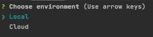

# MICROFRONTENDS EXAMPLE

## INTRODUCTION
This is a example of micro frontends and web components implementation

## REQUIREMENTS

- Node >= v14 (https://nodejs.org/es/download/)
- Angular CLI >= v10 (https://angular.io/cli)
- Vue CLI >= v3 (https://cli.vuejs.org/guide/installation.html)
- Docker
- Maven
- Java


## REPOSITORY STRUCTURE

The repository is structured in several folders depending on its responsibility:

- apps: they are final apps, composed by multiple modules and microfrontends
- microfrontends: this folder contains the different microfrontends implemented in this example.
- uicomponents: it contains fine grained reusable components.
- services: contains the different backend services 
- platform: folder used by store infrastructure components.


## INFRASTRUCTURE SETUP

This project has two different setups: local and cloud.
These configurations are detailed below:

### CLOUD ENVIRONMENT (AWS)
This setup is managed by Terraform and will create the following infrastructure:

- CDN: CloudFront

- Static content servers: S3

- API: API Gateway

- Authentication: Cognito

- Network: VPC with public and private subnets

- Containers Platform: EKS

- Containers Registry: ECR

- Database: RDS PostgreSQL

- Events: MSK

  

#### AWS Profile
To configure an AWS profile by using environment variables is necessary to export a variable called __AWS_PROFILE__. For instance:

```
export AWS_PROFILE=serverless
```

When Terraform script are executed, AWS CLI will use "serverless" profile

#### Create
Terraform scripts are placed in __platform/cloud/terraform__
In order to create all the infrastructure a right profile in AWS is needed. This profiles has to be allowed to manage:

    - CloudFront
    - S3
    - Cognito
    - API Gateway
    - EKS
    - ECR
    - RDS Postgresql
    - EC2
    - MSK

Once this profile is created and AWS CLI is configured in the machine where Terraform is going to be executed, we create
the infrastructure using the common Terraform commands (from 'platform/cloud/terraform'):

```
terraform init
terraform plan
terraform apply
```

When the infrastructure is created, Terraform will show the output values. For instance:

```
api_id = 4s790kmyq3
backoffice_client_id = qblosr0ba12cmth543i47ikg3
broker_client_id = 7daorv68p63499augulean3q9u
cognito_pool_id = eu-west-2_oQZpUXu4v
customers_client_id = 6to8fkd0tp8qf4df4etgikloof
```

These values will be used later to configure applications.


#### Configure Kubernetes 

Terraform scripts provide an EKS created but it's necessary to configure it in order to deploy backend services. To achieve this task just execute the shell script __config_cluster.sh__. Kubectl will be also configured to work with the EKS cluster. 

This script will deploy metrics and dashboard components in the EKS cluster and will show how to access to Kubernetes dashboard.


#### Database (RDS Postgres)

Database is created within a private network so if you want to access from your local computer you need to configure an ssh tunnel. How to get that is explained here: https://aws.amazon.com/es/premiumsupport/knowledge-center/rds-connect-ec2-bastion-host/


#### Destroy

To destroy the infrastructure created, just execute:

```
terraform destroy
```

If the infrastructure elements like S3 buckets are not empty, Terraform will not be able to destroy them. So, you must clean these elements before destroying with Terraform.


### LOCAL ENVIRONMENT

This setup is created using a docker-compose script, located in __platform/local__ and will create the following infrastructure:

- CDN: 
- Static content servers: NGINX
- API: NGINX
- Authentication: Keycloak
- Containers Platform: Docker (Docker-compose)
- Containers Registry: Docker
- Database: RDS PostgreSQL

In order to create the infrastructure, just execute (from 'platform/local'):
```
docker-compose up
```

Once the infrastructure is up and running, the following routes will be available:

- Customers application: http://localhost:9080
- Broker application: http://localhost:9099
- Backoffice application: http://localhost:9090
- Microfrontends Portal (Storybook): http://localhost:9000

The first time, those URLs doesn't work because you need to build and deploy applications (see "BUILDING APPS")

To destroy the infrastructure, just execute:

```
docker-compose down
```


## BUILDING APPS

To facilitate tasks like building and deploying applications, a CLI has been created.

CONFIGURING FRONTEND APPLICATIONS

Fronted applications need to authenticate in order to access to private areas. Authentication is different depending on the environment in which applications are executed. So, we have to differents tools:

- Cloud Environment: AWS Cognito
- Local Environment: Keycloak

Local environment doesn't need to be configured because values for Keycloack are always the same but Cloud environment does need to be configured in applications because Cloudfront url changes always the infrastructure is created. 

To configure enviroments in apps just modifying environment files located in __<app root folder>/src/environment__ (Broker app doesn`t perform real authentication in Cloud so it doesn't need to be configured). Cloud enviroment is associated to __enviroment.prod.ts__. In this file is necessary to modify the following values:

```
security: {
	allowedDomains: ['/api/*'],
  token: 'access_token',
  issuer: 'https://cognito-idp.eu-west-2.amazonaws.com/<cognito_pool_id>',
      clientid: '<client_id>',
      scope: 'openid profile email aws.cognito.signin.user.admin',
      logoutUrl: 'https://technology-bank.auth.eu-west-2.amazoncognito.com/logout?logout_uri=' + window.location.origin + "/logout" + '&client_id=<client_id>',
      userinfoEndpoint: 'https://technology-bank.auth.eu-west-2.amazoncognito.com/oauth2/userInfo'
```


### CLI

The CLI is located in __platform/cli__ and is built in NodeJS. If you are configuring the environment for the first time,
you need to install the packages first to execute the cli. To do that, execute (from __platform/cli__):

```
npm i
```

Once the packages are installed, to launch the cli just execute (from __platform/cli__):

```
npm start
```

The cli will show up:



We must choose between build and deploy applications in the local or cloud environment. If both, the cli asks if we want to deploy just a component or all the components:


If we choose "components", the next step is selecting between applications, micro frontends or UI components:


Finally, the cli shows the list of the components of the type selected we can deploy to local or cloud environment.
For instance, if we selected "Micro Frontends", the cli will show:


#### LOCAL

If we select "local" environment, distribution files associated to applications will be copied to the different volumes 
managed by the containers launch with Docker Compose. 

These volumes are associated with "content" folders existing in:

- local/backoffice-server
- local/broker-server
- local/customers-server
- local/microfrontends-server
- local/portal-server

For instance:


#### CLOUD
If we selected "cloud" environment, distribution files will be uploaded to S3 buckets using the AWS default profile or 
the profile configured in __AWS_PROFILE__ environment variable


## BUILDING BACKEND SERVICES

Building backend services are not necessary to configure to get the Micro Frontends PoC working because applications call to an API, that simulates responses. 

Backend services can be built and deployed to containers platform (AWS EKS) and then, will be necessary to configure manually the API to call real services


#### BUILDING SERVICES AND CREATING IMAGES

Services use Maven and Spring Boot plugin to manage build tasks and image generation. In order to perform all tasks, just execute (from the service root folder):

```
mvn spring-boot:build-image
```


#### PUBLISHING SERVICES TO ECR (ONLY CLOUD ENVIRONMENT)

If you are using the Cloud environment you need to publish service images to ECR in order to be deployed in Kubernetes later. 

To perform this tasks in a easy way, a shell script is provided. This script is placed in __k8s__ folder (in each service) and the script is named __publish_image.sh__. 


#### DEPLOYED SERVICES TO EKS (ONLY CLOUD ENVIRONMENT)

Once services images are published in the container repository (ECR), EKS will be able to pull them to launch pods containing these services.

To deploy these services just execute, from the k8s folder of each service, the following command:

```
kubectl apply -f deployment.yml -n <namespace>
```

Where <namespace> will be 

- accounts, 
- cards
- customers

 

#### PUBLISH SERVICES INTO API GATEWAY

Once the services are deployed, the first step is to know what is their public url (services are associated to a k8s service with type "Load Balancer"). 

To get this url, just execute:

```
kubectl describe service <service> -n <namespace>
```

where the pair of values (<service>, <namespace>) can be:

- accounts-service-srv, accounts
- cards-service-srv, cards
- customers-service-srv, customers

and copy the value associated to __"LoadBalancer Ingress"__

For instance:

```
Name:                     accounts-service-srv
Namespace:                accounts
Labels:                   app=accounts-service
                          version=1.0.0
Annotations:              kubectl.kubernetes.io/last-applied-configuration:
                            {"apiVersion":"v1","kind":"Service","metadata":{"annotations":{},"labels":{"app":"accounts-service","version":"1.0.0"},"name":"accounts-se...
Selector:                 deployment=accounts-service-dp
Type:                     LoadBalancer
IP:                       172.20.170.194
LoadBalancer Ingress:     ac81a912562874e7c98131666fdf6a4b-1879465082.eu-west-2.elb.amazonaws.com
Port:                     8080-tcp  8080/TCP
TargetPort:               8080/TCP
NodePort:                 8080-tcp  32105/TCP
Endpoints:                10.0.1.68:8080
Session Affinity:         None
External Traffic Policy:  Cluster
Events:                   <none>
```

Then, go to API Gateway console, and replace "simulation integration" by a "http integration". 


In the form, paste the url copied before:


Then, you have to "implement" the API in order to publish changes

